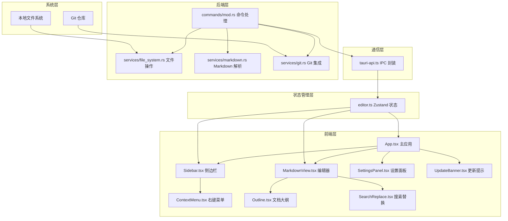

# InkDoc 项目 Code Wiki

## 1. 仓库概览

InkDoc 是一款极简的本地 Markdown 编辑器，采用飞书风格渲染，将本地文件系统作为数据库，提供所见即所得的编辑体验。

- **主要功能**：
  - 所见即所得 Markdown 编辑（基于 Milkdown）
  - 飞书风格渲染（优雅的排版效果）
  - 本地文件夹管理（文件树 + 搜索）
  - 右键菜单操作（新建、重命名、删除）
  - 自动保存与文件监听
  - Git 集成（自动提交推送）
  - 图片预览功能

- **典型应用场景**：
  - 个人知识库管理
  - 技术文档编写
  - 笔记整理与归档
  - 本地文档协作（多工具同步）

## 2. 目录结构

InkDoc 采用典型的 Tauri 项目结构，分为前端（React + TypeScript）和后端（Rust）两部分。前端负责用户界面和交互逻辑，后端负责文件系统操作、Markdown 解析和 Git 集成等核心功能。

```text
inkdoc/
├── src/                       # 前端 React 代码
│   ├── components/            # UI 组件
│   │   ├── Sidebar.tsx        # 文件树 + 搜索 + 右键菜单
│   │   ├── MarkdownView.tsx   # Milkdown 编辑器
│   │   ├── ContextMenu.tsx    # 右键菜单组件
│   │   ├── Outline.tsx        # 文档大纲
│   │   ├── SearchReplace.tsx  # 搜索替换功能
│   │   ├── SettingsPanel.tsx  # 设置面板
│   │   └── UpdateBanner.tsx   # 自动更新提示
│   ├── stores/                # 状态管理
│   │   └── editor.ts          # Zustand 全局状态
│   ├── lib/                   # 工具库
│   │   └── tauri-api.ts       # Tauri IPC 封装
│   ├── types/                 # TypeScript 类型定义
│   │   └── index.ts           # 共享类型
│   ├── App.tsx                # 主应用组件
│   ├── index.css              # 全局样式
│   └── main.tsx               # 应用入口
├── src-tauri/                 # Rust 后端代码
│   ├── src/                   # 后端源代码
│   │   ├── commands/          # Tauri 命令
│   │   │   └── mod.rs         # 命令实现
│   │   ├── services/          # 服务模块
│   │   │   ├── file_system.rs # 文件系统操作
│   │   │   ├── git.rs         # Git 操作
│   │   │   ├── markdown.rs    # Markdown 解析
│   │   │   └── mod.rs         # 服务模块导出
│   │   ├── lib.rs             # Tauri 应用入口
│   │   ├── main.rs            # 程序入口
│   │   └── types.rs           # Rust 类型定义
│   ├── icons/                 # 应用图标
│   ├── Cargo.toml             # Rust 依赖配置
│   └── tauri.conf.json        # Tauri 配置
├── package.json               # 前端依赖配置
├── tsconfig.json              # TypeScript 配置
└── vite.config.ts             # Vite 构建配置
```

**核心目录说明**：

| 目录/文件 | 主要职责 | 说明 |
|----------|---------|------|
| src/components/ | 前端 UI 组件 | 包含所有界面组件，如侧边栏、编辑器、上下文菜单等 |
| src/stores/ | 状态管理 | 使用 Zustand 管理全局状态，如文件树、当前文件等 |
| src/lib/ | 工具库 | 封装 Tauri API 调用，提供前端与后端通信的接口 |
| src-tauri/src/commands/ | 后端命令 | 定义 Tauri 命令，处理前端发起的各种请求 |
| src-tauri/src/services/ | 后端服务 | 实现文件系统操作、Markdown 解析、Git 集成等功能 |

## 3. 系统架构与主流程

InkDoc 采用前后端分离的架构模式，通过 Tauri 框架实现前端与后端的通信。前端使用 React + TypeScript 构建用户界面，后端使用 Rust 处理文件系统操作和其他核心功能。

### 系统架构图



### 主要流程

1. **应用启动流程**：
   - 加载上次打开的文件夹或弹出文件夹选择对话框
   - 读取文件夹结构，构建文件树
   - 启动文件监听器，监听文件变化
   - 检查应用更新

2. **文件编辑流程**：
   - 用户选择文件 → 后端读取文件内容 → 前端渲染编辑器
   - 用户编辑内容 → 前端更新状态 → 防抖自动保存 → 后端写入文件
   - 外部文件变化 → 后端文件监听器检测 → 前端自动更新

3. **文件操作流程**：
   - 用户右键点击 → 显示上下文菜单
   - 选择操作（新建、重命名、删除）→ 前端调用后端命令 → 后端执行操作 → 前端刷新文件树

4. **Git 集成流程**：
   - 检测当前文件夹是否为 Git 仓库
   - 配置自动推送参数
   - 定时执行 git add → git commit → git push

## 4. 核心功能模块

### 4.1 编辑器模块

编辑器模块是 InkDoc 的核心功能，基于 Milkdown Crepe 实现所见即所得的 Markdown 编辑体验，同时支持源码模式切换。

**主要功能**：
- 富文本编辑（所见即所得）
- Markdown 源码模式
- 图片路径处理（自动转换相对路径为 data URL）
- 粘贴 Markdown 内容自动解析
- 文档大纲生成
- 搜索替换功能

**关键实现**：
- 使用 Milkdown Crepe 作为编辑器核心
- 实现图片路径预处理和恢复
- 防抖自动保存机制
- 快捷键支持（Cmd+S 保存，Cmd+F 搜索）

### 4.2 文件系统模块

文件系统模块负责处理文件和文件夹的各种操作，包括读取、写入、创建、删除和重命名等。

**主要功能**：
- 文件夹树结构读取
- 文件内容读写
- 文件和文件夹的创建、删除、重命名
- 文件系统变化监听
- 图片文件读取（转换为 data URL）

**关键实现**：
- 使用 Rust 标准库和第三方库处理文件系统操作
- 实现递归读取文件夹结构
- 使用 notify 库实现文件系统监听
- 防抖处理文件变更事件

### 4.3 Git 集成模块

Git 集成模块提供 Git 仓库检测和自动提交推送功能，帮助用户自动备份文档。

**主要功能**：
- Git 仓库检测
- 分支和远程仓库信息获取
- 自动 commit + push
- 定时执行自动推送

**关键实现**：
- 使用 git2 库操作 Git 仓库
- 实现自动提交和推送逻辑
- 前端配置自动推送参数
- 定时任务执行自动推送

### 4.4 状态管理模块

状态管理模块使用 Zustand 管理全局状态，包括文件树、当前文件、编辑内容等。

**主要状态**：
- 根文件夹路径
- 文件树结构
- 当前打开的文件路径
- Markdown 内容
- 加载状态和错误信息
- 侧边栏可见性
- 图片预览路径

**关键实现**：
- 使用 Zustand 创建全局状态存储
- 实现文件操作的状态更新
- 处理文件监听器事件
- 管理编辑器状态

## 5. 核心 API/类/函数

### 5.1 前端核心 API

#### `useEditorStore`

**功能**：全局状态管理，提供文件操作和编辑器状态管理

**主要方法**：
- `openFolder(path: string)`: 打开文件夹并构建文件树
- `openFile(path: string)`: 打开文件并加载内容
- `saveCurrentFile()`: 保存当前编辑的文件
- `createNewFile(parentPath: string, name: string)`: 创建新文件
- `createNewFolder(parentPath: string, name: string)`: 创建新文件夹
- `deleteFileItem(path: string)`: 删除文件或文件夹
- `renameFileItem(oldPath: string, newName: string)`: 重命名文件或文件夹

**使用场景**：组件间状态共享，文件操作触发

#### `readFolder(dirPath: string)`

**功能**：读取文件夹结构，返回文件树

**参数**：
- `dirPath`: 文件夹路径

**返回值**：`FileNode[]` - 文件树节点数组

**使用场景**：初始化文件树，刷新文件树

#### `readFileRaw(filePath: string)`

**功能**：读取文件原始内容

**参数**：
- `filePath`: 文件路径

**返回值**：`string` - 文件内容

**使用场景**：打开文件时加载内容

#### `writeFile(request: WriteFileRequest)`

**功能**：写入文件内容

**参数**：
- `request`: 包含文件路径和内容的请求对象

**返回值**：`FileOperationResult` - 操作结果

**使用场景**：保存文件时调用

#### `startFileWatcher(dirPath: string)`

**功能**：启动文件系统监听器

**参数**：
- `dirPath`: 要监听的文件夹路径

**返回值**：`string` - 监听状态消息

**使用场景**：打开文件夹后启动监听

#### `onFileChange(callback)`

**功能**：监听文件变更事件

**参数**：
- `callback`: 事件回调函数

**返回值**：`UnlistenFn[]` - 取消监听的函数数组

**使用场景**：监听文件变化并更新界面

### 5.2 后端核心 API

#### `read_folder(dir_path: String)`

**功能**：读取文件夹结构，递归构建文件树

**参数**：
- `dir_path`: 文件夹路径

**返回值**：`Result<Vec<FileNode>, String>` - 文件树节点数组或错误信息

**使用场景**：前端请求文件夹结构

#### `read_file_raw(file_path: String)`

**功能**：读取文件原始内容

**参数**：
- `file_path`: 文件路径

**返回值**：`Result<String, String>` - 文件内容或错误信息

**使用场景**：前端打开文件时读取内容

#### `write_file(request: WriteFileRequest)`

**功能**：写入文件内容

**参数**：
- `request`: 包含文件路径和内容的请求对象

**返回值**：`Result<FileOperationResult, String>` - 操作结果

**使用场景**：前端保存文件时调用

#### `start_file_watcher(app: AppHandle, dir_path: String)`

**功能**：启动文件系统监听器，监听文件变化并发送事件

**参数**：
- `app`: Tauri 应用句柄
- `dir_path`: 要监听的文件夹路径

**返回值**：`Result<String, String>` - 监听状态消息或错误信息

**使用场景**：前端打开文件夹后启动监听

#### `git_auto_push(dir_path: String, commit_message: String)`

**功能**：执行 Git 自动提交和推送

**参数**：
- `dir_path`: Git 仓库路径
- `commit_message`: 提交信息

**返回值**：`Result<String, String>` - 操作结果或错误信息

**使用场景**：前端配置自动推送后定时执行

#### `read_image_as_data_url(file_path: String)`

**功能**：读取图片文件并转换为 base64 data URL

**参数**：
- `file_path`: 图片文件路径

**返回值**：`Result<String, String>` - data URL 或错误信息

**使用场景**：前端显示图片预览，编辑器中处理图片

## 6. 技术栈与依赖

| 类别 | 技术/依赖 | 用途 | 来源 |
|------|-----------|------|------|
| 桌面框架 | Tauri v2 | 跨平台桌面应用框架 | [package.json](file:///Users/yancy/Desktop/mydoc/package.json) |
| 前端 | React 19 | UI 构建 | [package.json](file:///Users/yancy/Desktop/mydoc/package.json) |
| 前端 | TypeScript | 类型安全 | [package.json](file:///Users/yancy/Desktop/mydoc/package.json) |
| 前端 | Tailwind CSS | 样式框架 | [package.json](file:///Users/yancy/Desktop/mydoc/package.json) |
| 前端 | Zustand | 状态管理 | [package.json](file:///Users/yancy/Desktop/mydoc/package.json) |
| 编辑器 | Milkdown Crepe | 所见即所得 Markdown 编辑器 | [package.json](file:///Users/yancy/Desktop/mydoc/package.json) |
| 后端 | Rust | 系统级编程 | [src-tauri/Cargo.toml](file:///Users/yancy/Desktop/mydoc/src-tauri/Cargo.toml) |
| 后端 | notify | 文件系统监听 | [src-tauri/Cargo.toml](file:///Users/yancy/Desktop/mydoc/src-tauri/Cargo.toml) |
| 后端 | serde | 序列化/反序列化 | [src-tauri/Cargo.toml](file:///Users/yancy/Desktop/mydoc/src-tauri/Cargo.toml) |
| 后端 | pulldown-cmark | Markdown 解析 | [src-tauri/Cargo.toml](file:///Users/yancy/Desktop/mydoc/src-tauri/Cargo.toml) |
| 后端 | git2 | Git 操作 | [src-tauri/Cargo.toml](file:///Users/yancy/Desktop/mydoc/src-tauri/Cargo.toml) |
| 构建工具 | Vite | 前端构建 | [package.json](file:///Users/yancy/Desktop/mydoc/package.json) |

## 7. 关键模块与典型用例

### 7.1 编辑器使用指南

**功能说明**：编辑器模块提供所见即所得的 Markdown 编辑体验，支持富文本编辑和源码模式切换。

**配置与依赖**：
- 依赖：Milkdown Crepe
- 配置：无特殊配置，直接使用

**使用示例**：

1. **打开文件**：
   - 在侧边栏中点击 Markdown 文件
   - 编辑器自动加载文件内容并渲染

2. **编辑内容**：
   - 直接在编辑器中修改内容（所见即所得）
   - 点击右下角 "源码" 按钮切换到源码模式
   - 编辑完成后自动保存（1秒防抖）

3. **插入图片**：
   - 直接粘贴图片文件
   - 或使用 Markdown 语法 ``
   - 编辑器会自动处理相对路径

4. **使用大纲**：
   - 左侧大纲面板显示文档结构
   - 点击大纲项快速跳转到对应位置

5. **搜索替换**：
   - 按下 Cmd+F 打开搜索面板
   - 输入搜索内容和替换内容
   - 执行替换操作

### 7.2 文件管理指南

**功能说明**：文件管理模块提供文件和文件夹的创建、删除、重命名等操作。

**配置与依赖**：
- 依赖：Tauri 文件系统 API
- 配置：无特殊配置，直接使用

**使用示例**：

1. **打开文件夹**：
   - 首次启动时会弹出文件夹选择对话框
   - 或通过设置面板重新选择文件夹

2. **创建文件**：
   - 在侧边栏中右键点击文件夹
   - 选择 "新建文件"
   - 输入文件名（包含 .md 扩展名）

3. **创建文件夹**：
   - 在侧边栏中右键点击文件夹
   - 选择 "新建文件夹"
   - 输入文件夹名

4. **重命名文件/文件夹**：
   - 在侧边栏中右键点击文件或文件夹
   - 选择 "重命名"
   - 输入新名称

5. **删除文件/文件夹**：
   - 在侧边栏中右键点击文件或文件夹
   - 选择 "删除"
   - 确认删除操作

### 7.3 Git 集成指南

**功能说明**：Git 集成模块提供 Git 仓库检测和自动提交推送功能。

**配置与依赖**：
- 依赖：git2 库
- 配置：在设置面板中配置自动推送参数

**使用示例**：

1. **检测 Git 仓库**：
   - 打开一个 Git 仓库文件夹
   - 系统会自动检测并显示 Git 信息

2. **配置自动推送**：
   - 打开设置面板
   - 启用 "自动推送"
   - 设置推送间隔（分钟）
   - 输入提交信息模板

3. **手动执行推送**：
   - 在设置面板中点击 "立即推送"
   - 系统会执行 git add → git commit → git push

## 8. 配置、部署与开发

### 8.1 开发环境搭建

**系统要求**：
- macOS 12+
- Node.js 18+
- Rust 1.70+
- Xcode Command Line Tools

**安装步骤**：

1. **克隆仓库**：
   ```bash
   git clone https://github.com/Asthenia0412/InkDoc.git
   cd inkdoc
   ```

2. **安装前端依赖**：
   ```bash
   npm install
   ```

3. **启动开发模式**：
   ```bash
   npm run tauri dev
   ```

### 8.2 构建与部署

**构建步骤**：

1. **构建应用**：
   ```bash
   npm run tauri build
   ```

2. **构建产物**：
   - 构建产物位于 `src-tauri/target/release/bundle/`
   - macOS: `.dmg` 文件
   - Windows: `.exe` 安装程序
   - Linux: `.deb` 或 `.AppImage` 文件

**部署方式**：
- 本地安装：双击构建产物进行安装
- 分发：上传到 GitHub Releases 或其他分发平台

### 8.3 配置文件

**主要配置文件**：

1. **tauri.conf.json**：
   - Tauri 应用配置
   - 包含应用名称、版本、窗口设置等

2. **package.json**：
   - 前端依赖配置
   - 包含脚本命令、依赖包等

3. **Cargo.toml**：
   - Rust 后端依赖配置
   - 包含 Rust 包依赖、版本等

4. **vite.config.ts**：
   - Vite 构建配置
   - 包含别名、插件等设置

## 9. 监控与维护

### 9.1 日志管理

- **前端日志**：
  - 使用浏览器开发者工具查看控制台日志
  - 错误信息会显示在应用界面顶部

- **后端日志**：
  - 开发模式下，后端日志会输出到终端
  - 生产模式下，日志会输出到系统日志

### 9.2 常见问题与解决方案

| 问题 | 原因 | 解决方案 |
|------|------|----------|
| 无法打开文件夹 | 权限不足 | 确保应用有文件系统访问权限 |
| 文件保存失败 | 文件被占用 | 关闭其他可能占用文件的应用 |
| Git 推送失败 | 网络问题或认证失败 | 检查网络连接和 Git 认证 |
| 编辑器崩溃 | 内存不足或插件冲突 | 重启应用，检查文件大小 |
| 图片显示失败 | 路径错误或文件损坏 | 检查图片路径，确认文件完整性 |

### 9.3 性能优化

- **文件树渲染**：
  - 限制递归深度（默认10层）
  - 懒加载文件夹内容

- **编辑器性能**：
  - 防抖保存（1秒延迟）
  - 图片路径预处理
  - 大文件处理优化

- **文件监听**：
  - 过滤隐藏文件
  - 防抖处理事件（300ms）

## 10. 总结与亮点回顾

### 10.1 项目亮点

1. **架构设计**：
   - 采用 Tauri 框架，实现轻量级桌面应用
   - 前后端分离，职责清晰
   - 使用 Rust 作为后端，性能优异

2. **用户体验**：
   - 飞书风格渲染，美观优雅
   - 所见即所得编辑，操作直观
   - 本地文件系统管理，安全可靠

3. **功能特色**：
   - 智能图片路径处理
   - Git 自动推送备份
   - 实时文件监听同步
   - 文档大纲导航

4. **技术实现**：
   - 使用 Zustand 进行状态管理，轻量高效
   - 防抖保存机制，避免频繁 IO
   - 多线程文件监听，响应迅速
   - 图片转 base64 处理，避免路径问题

### 10.2 应用价值

InkDoc 为用户提供了一种简单、高效、美观的本地 Markdown 编辑解决方案，特别适合：

- **个人知识库管理**：本地存储，安全可控
- **技术文档编写**：Markdown 格式，便于版本控制
- **笔记整理**：飞书风格渲染，阅读体验好
- **多设备同步**：结合 Git，实现跨设备同步

### 10.3 未来展望

- **跨平台支持**：扩展到 Windows 和 Linux 平台
- **插件系统**：支持自定义插件扩展功能
- **云同步**：可选的云存储同步功能
- **协作编辑**：支持多人协作编辑
- **导出功能**：支持导出为 PDF、HTML 等格式

InkDoc 以其简洁的设计理念和优秀的用户体验，为 Markdown 编辑工具领域带来了新的选择，展现了 Tauri + Rust + React 技术栈的强大潜力。